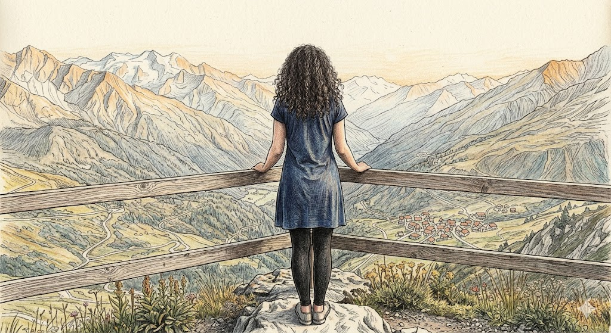

# The Kingdom of Chanderbhaga - Three Crimes

```
Once upon a time, in the northern lands of Bharat, on the banks of the river Chanderbhaga,
there stood a magnificent kingdom. The king's palace was situated at the top of a mountain peak, 
so high and so fortified that every enemy attack crumbled to failure before it could even begin.
```

```
The surroundings were breathtakingly beautiful, a dense forest, and
the sweet melody of the 'Koyal' drifting through the air.
```

```
A vast blue sky, golden sunlight, towering mountains,
cool gentle breezes — and the palace standing proud above it all.

The nights were even more enchanting — a sky full of twinkling stars, 
a grand full moon casting silver light across the valley,
and the soft murmur of the river below.
```


```
One day, an unusual complaint arrived in the king's royal court.
A man came forward as the complainant, 
claiming that a certain young woman had been troubling him greatly —
and that she was also a thief.
Both the complainant and the young woman were summoned before the court. 
The woman flatly denied every single accusation and
declared the complainant to be nothing short of a Pagal.
```

`Complainant`: "Your Majesty, this woman — with eyes like a 'MrigNaini' and a smile that would make even the moon blush with shame — is a great thief. She has committed three crimes against me."

`King`: "Hey, Lady, you are the very image of beauty — even the Apsaras of Indra would feel jealous standing beside you. Why on earth would someone like you need to steal?"

`Woman`: "I beg your pardon, Your Majesty. I have stolen nothing. This complainant is simply a Pagal."

`Complainant`: "Your Majesty, not only has she stolen, but she has tormented me greatly. I humbly request that you award her the harshest punishment possible."

`King`: "Young woman, what exactly have you done?"

`Woman`: "Forgive me, Your Majesty. I have done nothing of the sort. This man is completely Pagal."

`King`: (growing impatient) "Complainant! Speak clearly — what exactly is this woman's crime?"

`Complainant`: "Your Majesty... the first crime —

```
This woman makes my heart beat faster than it should.
The moment I see her, my heart begins to pound uncontrollably.
When she is not around, I cannot focus on anything at all.
Once, she came with her hair styled in some peculiar,
noodle-like way — like a view from which I can't take my eyes.
That day, my heart crossed 150 beats per minute.
Because of all this, Your Majesty, I find it nearly impossible to hold a normal conversation with her..."
```

(A deep silence fell over the royal court. Even the king began to wonder if the complainant had indeed lost his mind.)
(The woman seems to be blushing but hides it from the royal court...)


## Crime 2

`King` : (Laughing) What's the second crime?




`Complainant`:
```
  My dear King, this woman is a threat to your kingdom too.
  One day, she was wearing leggings and a frock.
  You won't believe, Your Highness, that sight made me faint.

  Even the prince of the neighbouring kingdom would be stunned by the sight.
  Your Highness, I was wondering if they came to know about her,
  then the Prince would call off the marriage with your Princess and even start
  a war to win her heart...
  
```

(The king is shocked but keeps his composure and asks the woman what she has to say...)
(The woman's cheeks were red , she was silent but her eyes said it all...)

`King` : (Angry) How dare you make such a comment about the Princess..? I will have you beheaded for this...!

`One of the ministers` : ( In low voice to the King ) Your highness, please calm down. This man is definitely has lost his mind.
                          Please show mercy on him. 
                          (The King calms down and asks the complainant to present his 
                          third crime) ...


## Crime 3

`Complainant`: 

```
Your Highness... this woman... this woman... she is a thief!

I think she has no heart,
she is moving around the kingdom stealing many hearts...
And I am one of the victims of her magnificent eyes and breathtaking smile.

I request your Highness to punish her ...!
```


(The whole court started laughing ..., even the king couldn't control his laughter ...)


## Judgement

```
To be continued... 

```
